# BEDmaker GUI 🛏️🔬

BEDmaker GUI is a web-based tool developed by the Synnovis Bioinformatics teams at Guy's and St Thomas' NHS Foundation Trust. It allows users to generate BED (Browser Extensible Data) files using the [Ensembl Tark](https://tark.ensembl.org/) and [VEP](https://rest.ensembl.org/#VEP) RESTful APIs.

- **Gene Symbols and Transcript IDs**: When users input gene symbols or transcript IDs, the BED File Generator queries the Tark API to retrieve the corresponding transcript data, including exon boundaries and other relevant information.
- **rsIDs and Genomic Coordinates**: For rsIDs and specific genomic coordinates, the tools uses the VEP API to fetch detailed variant annotations and their genomic positions.


## Screenshots

<div align="center" style="margin-top: 20px; padding-top: 20px;">
    <br></br>
    <figcaption style="text-align: center; font-size: 0.9em; color: #6c757d;">Figure 1: User interface of the BED File Generator showing the input form.</figcaption><br></br>
    <br></br>
    <figcaption style="text-align: center; font-size: 0.9em; color: #6c757d;">Figure 2: Results viewer displaying generated BED file data with options for customisation and download.</figcaption>
</div>

## Features

- Generate BED files from:
    - Gene symbols
    - Transcript IDs
    - rsIDs
    - Genomic coordinates
- Support for both GRCh37 (hg19) and GRCh38 (hg38) genome assemblies
- Integration with PanelApp for importing gene lists from predefined panels
- Custom padding to gene regions
- UTRs inclusion/exclusion
- Interactive results view with IGV (Integrative Genomics Viewer) integration
- User customisable BED file output in various formats (.bed, .data, .sambamba, .exomeDepth, .CNV)
- User authentication and authorisation system

## Functionality schema

<div align="center">
    
</div>

## Prerequisites

- Python 3.9+
- Flask
- SQLite3
- Docker (optional, for containerized deployment)

## Installation

1. Clone the repository:
   ```
   git clone <repository_url>
   cd bed-file-generator
   ```

2. Set up a virtual environment:
   ```
   python -m venv venv
   source venv/bin/activate  # On Windows, use `venv\Scripts\activate`
   ```

3. Install the required packages:
   ```
   pip install -r requirements.txt
   ```

4. Set up environment variables:
   Create a `.env` file in the project root and add the following:
   ```
   BED_GENERATOR_FLASK_KEY=<your_secret_key>
   DATABASE_URL=sqlite:///instance/transcript.db
   ```

5. Initialize the database:
   ```
   flask db init
   flask db migrate
   flask db upgrade
   ```

6. Create an initial admin user:
   ```
   python create_user.py
   ```

## Running the Application

### Development Mode

Run the following command:
```
flask run
```

The application will be available at `http://localhost:5000`.

### Production Mode

For production deployment, it's recommended to use Gunicorn:
```
gunicorn -b 0.0.0.0:5000 run:app
```

### Docker Deployment

1. Build the Docker image:
   ```
   docker build -t bed-file-generator:1.0.0 .
   ```

2. Run the container:
   ```
   docker run -p 5000:5000 -e BED_GENERATOR_FLASK_KEY=<your_secret_key> bed-file-generator:1.0.0
   ```

Alternatively, use Docker Compose:
```
docker-compose up
```

## Usage

1. Navigate to the application in your web browser.
2. Log in using your credentials.
3. Use the BED Generator form to input gene symbols, rsIDs, or coordinates.
4. Select the desired genome assembly and adjust settings as needed.
5. Generate the BED file and review the results in the interactive viewer.
6. Download the BED file in your preferred format or submit it for review.

## Project Structure

- `app/`: Main application package
  - `auth/`: Authentication-related modules
  - `bed_generator/`: Core BED file generation logic
  - `bed_manager/`: BED file management system
  - `templates/`: HTML templates
  - `static/`: Static files (CSS, JS, images)
- `config.py`: Configuration settings
- `create_user.py`: Script to create admin users (can also be accessed via the web app)
- `run.py`: Application entry point


## Acknowledgments

- Developed by the Synnovis Bioinformatics Team @ Guy's and St Thomas' NHS Foundation Trust (2024)
- Uses IGV.js v3.0.8 for genomic visualization
- Integrates with PanelApp v2 API
- Utilises Ensembl VEP (v113) and TARK (v1.0.1) RESTful APIs for metadata

## Edge case testing

#### MANE Clinical Plus transcripts

```
SLC39A14 query in GRCh38 returns both MANE SELECT and MANE CLINICAL PLUS successfully.
Warning is presented to user.

SLC39A14 query in GRCh37 returns both MANE SELECT equivalent successfully.
No warning is presented as MANE CLINICAL PLUS is not available in GRCh37.
```

#### UTRs spanning multiple exons

#### CPv2, hg19 - 660 gene query

```
Options
BED file generated with 

Problematic genes:
MAP3K20 - No hg19 transcripts are available in the TARK API for this query.
RNU4ATAC - non_protein_coding transcript selected. Adjust logic to flag and include in results.
RMRP - non_protein_coding transcript selected. Adjust logic to flag and include in results.
RNU12 - non_protein_coding transcript selected. Adjust logic to flag and include in results.
TERC - non_protein_coding transcript selected. Adjust logic to flag and include in results.
```
